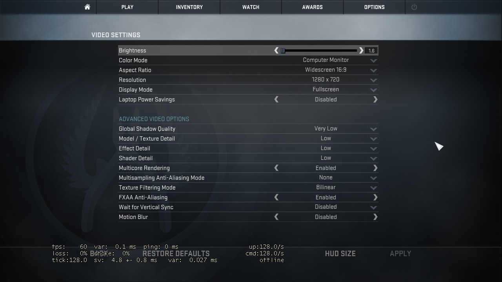

# csgo-cfg
## Launch options
-gl -high -dxlevel 95 -novid -nojoy -nosync +cpu_frequency_monitoring 2 +cl_forcepreload 1  -language english -noforcemaccel -noforcemspd -noforcemparms +mat_vignette_enable 0  -cpuCount=2, -exThreads=3 -tickrate 128
## Hardware
DELL Inspiron 7720R
Intel i5-3210 @ 2.50 GHz (Two cores)
4GB RAM
nVIDIA Geforce GT 650m in MSI-MODE (http://forums.guru3d.com/showthread.php?t=378044)
Windows 7 x64
## Peripherals
CM Storm Xornet (500 dpi)
A4tech x7-Gaming 500MP
AKG k514 MK2 White
## Loadout
M4A4-S, USP-S, CZ-75, Tec-9
## Misc
Resolution: 4:3 BB
Digital Vibrance/saturation: 100%
**Caps Lock as CTRL, CTRL as Caps Lock (!!!!)**
## In-Game Graphic settings

